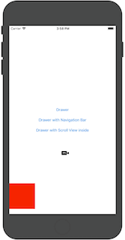
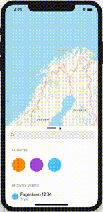

# Drawer

A `Drawer` is an iOS drop-in class that displays a draggable/resizeable drawer component similar to the search bar in Apple Maps and Google Maps.

[](assets/example-drawer.gif)
[](assets/example-maps.gif)

## Requirements

Works on iOS 11+

### SwiftPM

1. Add the following to your `Package.swift`:
	```swift
	.package(url: "https://github.com/shortcut/drawer-ios.git", .upToNextMajor(from: "1.0")),
	```
2. Next, add `Drawer` to your App targets dependencies like so:
	```swift
	.target(name: "App", dependencies: ["Drawer"]),
	```
3. Then open your project in Xcode 11+.

## Usage

To you have a view controller that you want to be displayed as a drawer occupying half of the screen it only a few lines of code is needed.

```swift
    let myViewController = MyViewController()

    let config = DrawerConfiguration(
        snapPoints: [
            .top,
            .fraction(value: 0.5),
            .dismiss],
        defaultSnapPoint: .fraction(value: 0.5),
        shouldAllowTouchPassthrough: true,
        shouldDismissOnOutsideTap: true)

    let drawerViewController = DrawerViewController(viewController: myViewController, configuration: config)

    present(drawerViewController, animated: true)
```

## License

This code is distributed under the terms and conditions of the [MIT license](LICENSE.md).
